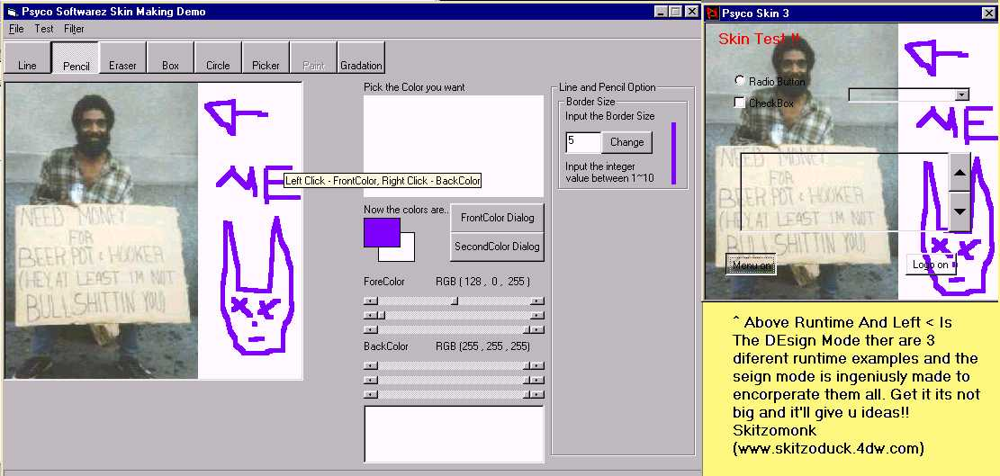



## RunTime Skin Customiser and Demos  \*\*\*\*\*\*\*\* UPDATED \*\*\*\*\*\*\*\* \#\#\#\#\# NOW FIXED \#\#\#\#\#  \!\!\!\!\! YAY\!\!\!\!\!\!\!

### Description

This Code Lets The User Design A skin Very Easily for one of your programs, It is Very easily customisable and the user can do a quick preview, The code is set up for the 3 test programs i have included, These also teach you basic functions of visual basic so if your a newbie and wanna get started download this, To Know the style of this project you really have to download, If nothing else its just interesting

P.S You Dont have to supply the skin maker with yout Project you can just Use it to make cool skins for ur prog.You need microsoft form 2.0 object library to use the demo projects and priveiw screen. THIS CODE IS SO EFFECTIVE YET SUPER SIOMPLE U'LL LAUGH! It can teach everyobody something about something! IF YOU LIKE IT PLEASE VOTE, I NEARLY GIVE UP VB LAST TIME CUZ NO ONE VOTED!!!
 
### More Info
 

             |
---                |---
**Submitted On**   |2001-05-24 22:46:32
**By**             |[Skitzo Monk](https://github.com/Planet-Source-Code/PSCIndex/blob/master/ByAuthor/skitzo-monk.md)
**Level**          |Intermediate
**User Rating**    |4.6 (23 globes from 5 users)
**Compatibility**  |VB 5\.0, VB 6\.0
**Category**       |[Custom Controls/ Forms/  Menus](https://github.com/Planet-Source-Code/PSCIndex/blob/master/ByCategory/custom-controls-forms-menus__1-4.md)
**World**          |[Visual Basic](https://github.com/Planet-Source-Code/PSCIndex/blob/master/ByWorld/visual-basic.md)
**Archive File**   |[RunTime Sk200605252001\.zip](https://github.com/Planet-Source-Code/skitzo-monk-runtime-skin-customiser-and-demos-updated-now-fixed-yay__1-23125/archive/master.zip)

